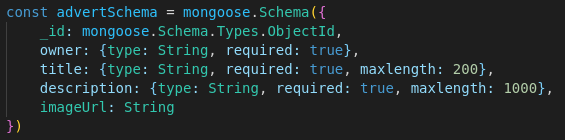
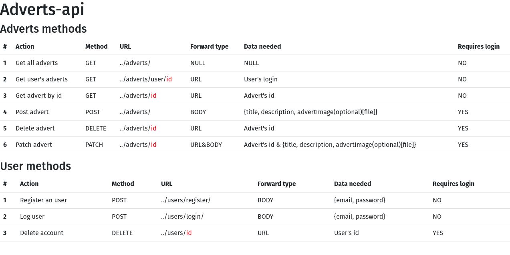
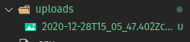
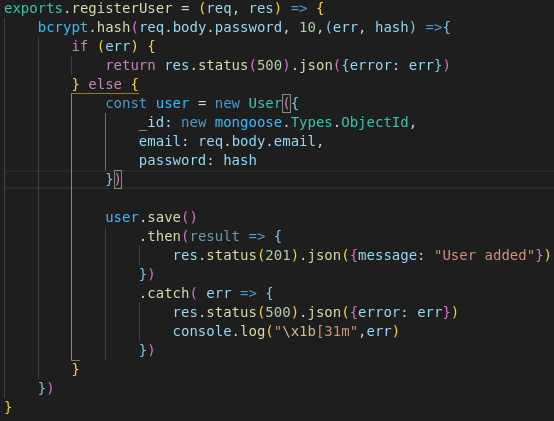
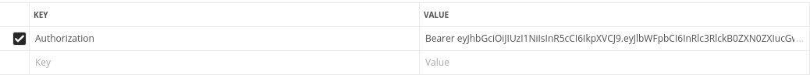
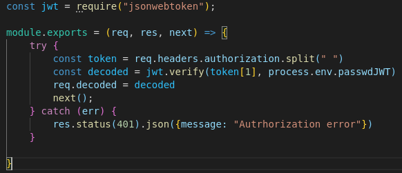
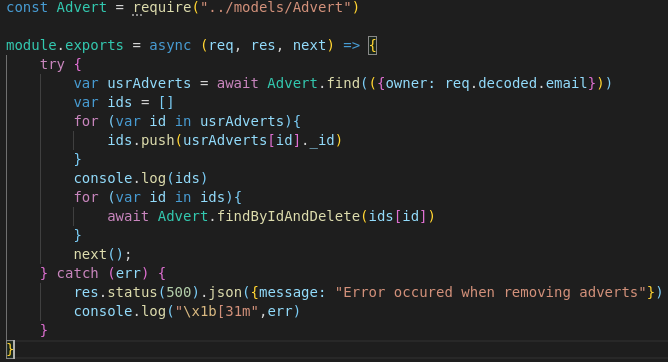
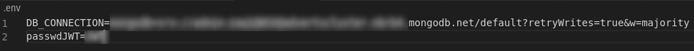

# Adverts-Express-api
Adverts-Express-api is an api written in Express as a part of completing the course.

The app is a backend for ReactJs application that was allso prepaired to complete the course.
You can check it out [here.](https://github.com/martyna-w/Adverts-React)

## Table of contents
* [What does it do](#what-does-it-do)
* [Main features](#main-features)
* [Security features](#security-features)

## What does it do
Adverts-Express-api is an api writen in Express framework. It uses Moongoose to connect with MongoDb database.
It allows users to add, browse, modify and delete simple adverts. 

It support user accounts, which are necessary for advanced operations like adding, deleting, etc. adverts.
For full list of features go to: [Main features](#main-features)

## Main features

### Adverts

The main goal of adverts-express-api to provide respones for frontend aplications. Adverts consists of owner (account that was used to create an advert), title,
description, and optional picture (see the picture above). Supported advert methods:

* Get all adverts
* Get user's adverts
* Get selected advert
* Post an advert*
* Modify (patch) an advert*
* Delete an advert*

*User account is required

### User accounts

User accounts are obligatory for those who want to use all of the functionalities of the application. Anybody can request for adverts but only users with 
created account are able to add, modify and delete advertisments. Supported user methods:

* Register
* Login
* Delete account*

*User account is required

### Landing page
The api is equipped with simple landing page with basic description of methods

### Pictures
Users can add pictures to the adverts, but they are not obligatory. The pictures are directly stored in the api, and provided when necessary.
Urls are stored in the database within the advert.

## Security features

### Password encoding with bcrypt
All the passwords are encoded using bcrypt

### Token authentication
As previously said, advanced advert operations require user account. Users acquire token, which enables them to do advanced operations, 
while logging. Token authentication is achieved with JWT.

### Auto-advert delete
Api is prepaired for situations where user wants to delete an account without deleting his adverts. All user's adverts are deleted with the user account.

### Seprate file for connections
Database connetion string and password hash are stored in seperated .env file, whitch can bea added to gitignore file, to prevent publishing.

### Data validation
Adverts and user account are validated in the app. (See the [picture](#what-does-it-do) )

